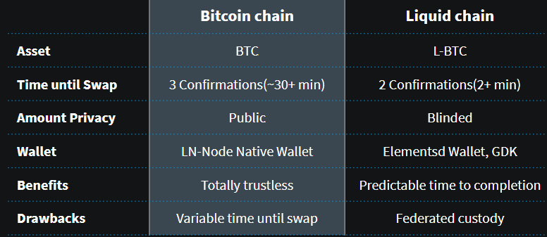

# PeerSwap

*Disclaimer: PeerSwap is beta-grade software.*

*We currently only recommend using PeerSwap with small balances or on signet/testnet*

*THE SOFTWARE IS PROVIDED "AS IS", WITHOUT WARRANTY OF ANY KIND, EXPRESS OR
IMPLIED, INCLUDING BUT NOT LIMITED TO THE WARRANTIES OF MERCHANTABILITY,
FITNESS FOR A PARTICULAR PURPOSE AND NONINFRINGEMENT. IN NO EVENT SHALL THE
AUTHORS OR COPYRIGHT HOLDERS BE LIABLE FOR ANY CLAIM, DAMAGES OR OTHER
LIABILITY, WHETHER IN AN ACTION OF CONTRACT, TORT OR OTHERWISE, ARISING FROM,
OUT OF OR IN CONNECTION WITH THE SOFTWARE OR THE USE OR OTHER DEALINGS IN THE
SOFTWARE.*

*The PeerSwap project is not responsible for how you deploy, distribute, or integrate Peerswap. Please refer to your local system administrator, PaaS provider, or appliance distributor. A few community Docker examples can be found [here](https://github.com/tiero/peerswap-box) and [here](https://github.com/vilm3r/docker-peerswap). PeerSwap cannot provide official Docker containers for these reasons:

* PeerSwap CLN plugin must be in the same Docker container as CLN due to how plugins work.
* PeerSwap LND daemon currently has an issue with Docker's internal networking, therefore the daemon needs to be run inside the same container as LND. [Read more](.docs/docker.md).

PeerSwap enables Lightning Network nodes to balance their channels by facilitating atomic swaps with direct peers. PeerSwap enhances decentralization of the Lightning Network by enabling all nodes to be their own swap provider. No centralized coordinator, no 3rd party rent collector, and lowest cost channel balancing means small nodes can better compete with large nodes.

- [PeerSwap](#peerswap)
  - [Project Status](#project-status)
  - [Get Involved](#get-involved)
  - [Getting Started](#getting-started)
    - [Setup](#setup)
    - [Usage](#usage)
    - [Upgrading](#upgrading)
  - [Further Information](#further-information)
    - [FAQ](#faq)
    - [Signet Testing](#signet-testing)
      - [core-lightning](#core-lightning)
      - [lnd](#lnd)
    - [Development](#development)

## Project Status

PeerSwap is beta-grade software that can be run as a [core-lightning](https://github.com/ElementsProject/lightning) plugin or as a standalone daemon/cli with [LND](https://github.com/lightningnetwork/lnd)

As we don't have a proven fee model for swaps yet, we only allow swaps with allowlisted peers.

PeerSwap allows two different types of swaps:

- [Swap-in:](./docs/peer-protocol.md#summary) trading an onchain-asset for lightning outbound liquidity
- [Swap-out:](./docs/peer-protocol.md#summary-1) trading an onchain-asset for lightning inbound liquidity

We have a detailed [Spec-draft](./docs/peer-protocol.md) available for review and reimplementation. An interoperable second implementation and discussions toward the next protocol upgrade are currently underway.

## Get Involved
Join our Discord to meet other PeerSwap node operators, for support, or to get involved with development as we work toward adding more features and usability improvements.

Follow <a href="https://twitter.com/PeerswapLN">@PeerSwapLN on Twitter</a> to keep up with project announcements.

## Getting Started

### Setup
you can use peerswap with lnd and core-lighting:

To run peerswap as a core-lightning plugin see the [core-lightning setup guide](./docs/setup_cln.md)

To run peerswap as a standalone daemon with lnd see the [lnd setup guide](./docs/setup_lnd.md)

### Usage

See the [Usage guide](./docs/usage.md) for instructions on how to use PeerSwap.

### Upgrading
See the [Upgrade guide](./docs/upgrade.md) for instructions to safely upgrade your PeerSwap binary.

## Further Information
### FAQ

* What is the difference between BTC and L-BTC Swaps?
  * 
* Why should use PeerSwap instead of centralized markets for submarine swaps?
  * More Reliable - PeerSwap is significantly more reliable because you are not reliant on unknown channel balances, random network degredation, and slow routing attempts as often occur with multi-hop routes.
  * Lower Cost - PeerSwap is the lowest cost because there is no 3rd party coordinator or intermediary nodes to collect rent.
  * More Private - Swaps are entirely between two consenting nodes. Nobody else is able to record details like who swapped.
* What is the difference between [splicing](https://github.com/lightning/bolts/pull/863) and PeerSwap?
  * Splicing will take a long time to become code ready and widely available. Meanwhile PeerSwap is very simple and already works today without changes to existing LN nodes.
* What is the difference between [liquidity-ads](https://github.com/lightning/bolts/pull/878) and PeerSwap?
  * Liquidity Ads is a great way to lease new channels to be opened toward you for the purpose of gaining incoming capacity. New channels add new capacity in a desired direction but only once.
  * PeerSwap lets you repeatedly refill your existing channels at a cost lower than opening, closing, and maintaining additional channels.
* Why PeerSwap instead of opening more channels?
  * PeerSwap can be more tolerant of onchain confirmation delay than LN channel open/close so BTC onchain fee rates could be lower. Large service providers like stores often close channels when they are depleted because it is capital inefficient to leave them open while unbalanced. Channel closing is often unexpectedly expensive so it is beneficial to reduce the frequency of channel closures.
  * It is more capital efficient to refill channels that already exist rather than open yet more channels with the same peer in order to improve your routing capacity.
  * PeerSwap nodes have the option of alternate swap assets. For example Liquid L-BTC can be faster and with greater transaction privacy (with some trade offs). Additional optional swap methods can be added to PeerSwap for users who want them without affecting users who don't.
* Why test with Signet instead of Testnet?
  * PeerSwap supports Bitcoin testnet3 but we strongly recommend instead testing with [Bitcoin Signet](https://en.bitcoin.it/wiki/Signet). Testnet has significant reliability problems like often no blocks, or too many blocks, or sometimes 10,000 block reorgs. If your goal is to test software integrations dealing with chaotic situations like reorgs or for race conditions you should be using regtest where you have control of that chaos.

### Signet Testing

#### Core Lightning
For a Core Lightning bitcoin-signet / liquid-testnet setup guide see this [guide](./docs/signetguide_cln.md)

#### lnd
For a lnd bitcoin-signet / liquid-testnet setup guide see this [guide](./docs/signetguide_lnd.md)

### Development

PeerSwap uses the [nix](https://nixos.org/download.html) package manager for a simple development environment
In order to start hacking, install nix, [golang](https://golang.org/doc/install) and run `nix-shell`. This will fetch all dependencies (bar golang).
