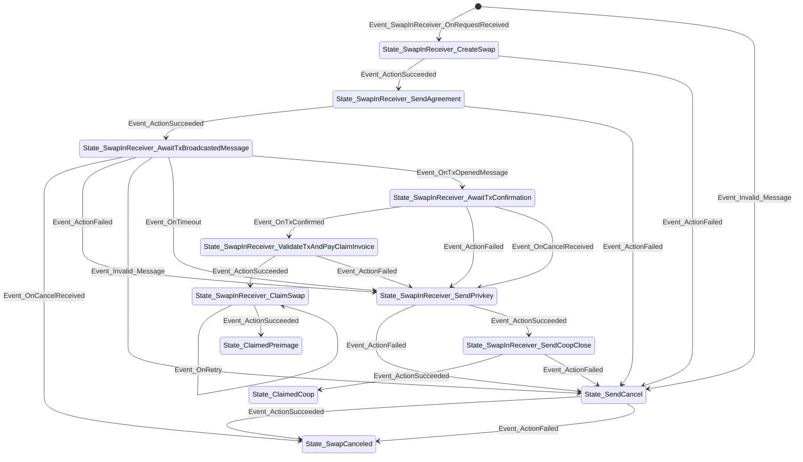

```mermaid
stateDiagram-v2
State_SwapInReceiver_SendCoopClose
State_SwapInReceiver_SendCoopClose --> State_ClaimedCoop: Event_ActionSucceeded
State_SwapInReceiver_SendCoopClose --> State_SendCancel: Event_ActionFailed
State_SwapInReceiver_ClaimSwap
State_SwapInReceiver_ClaimSwap --> State_SwapInReceiver_ClaimSwap: Event_OnRetry
State_SwapInReceiver_ClaimSwap --> State_ClaimedPreimage: Event_ActionSucceeded
State_SendCancel
State_SendCancel --> State_SwapCanceled: Event_ActionSucceeded
State_SendCancel --> State_SwapCanceled: Event_ActionFailed
[*] --> State_SwapInReceiver_CreateSwap: Event_SwapInReceiver_OnRequestReceived
[*] --> State_SendCancel: Event_Invalid_Message
State_SwapInReceiver_CreateSwap
State_SwapInReceiver_CreateSwap --> State_SwapInReceiver_SendAgreement: Event_ActionSucceeded
State_SwapInReceiver_CreateSwap --> State_SendCancel: Event_ActionFailed
State_SwapInReceiver_SendAgreement
State_SwapInReceiver_SendAgreement --> State_SwapInReceiver_AwaitTxBroadcastedMessage: Event_ActionSucceeded
State_SwapInReceiver_SendAgreement --> State_SendCancel: Event_ActionFailed
State_SwapInReceiver_AwaitTxConfirmation
State_SwapInReceiver_AwaitTxConfirmation --> State_SwapInReceiver_ValidateTxAndPayClaimInvoice: Event_OnTxConfirmed
State_SwapInReceiver_AwaitTxConfirmation --> State_SwapInReceiver_SendPrivkey: Event_ActionFailed
State_SwapInReceiver_AwaitTxConfirmation --> State_SwapInReceiver_SendPrivkey: Event_OnCancelReceived
State_SwapInReceiver_ValidateTxAndPayClaimInvoice
State_SwapInReceiver_ValidateTxAndPayClaimInvoice --> State_SwapInReceiver_ClaimSwap: Event_ActionSucceeded
State_SwapInReceiver_ValidateTxAndPayClaimInvoice --> State_SwapInReceiver_SendPrivkey: Event_ActionFailed
State_ClaimedCoop
State_SwapInReceiver_AwaitTxBroadcastedMessage
State_SwapInReceiver_AwaitTxBroadcastedMessage --> State_SwapCanceled: Event_OnCancelReceived
State_SwapInReceiver_AwaitTxBroadcastedMessage --> State_SwapInReceiver_SendPrivkey: Event_ActionFailed
State_SwapInReceiver_AwaitTxBroadcastedMessage --> State_SendCancel: Event_Invalid_Message
State_SwapInReceiver_AwaitTxBroadcastedMessage --> State_SwapInReceiver_SendPrivkey: Event_OnTimeout
State_SwapInReceiver_AwaitTxBroadcastedMessage --> State_SwapInReceiver_AwaitTxConfirmation: Event_OnTxOpenedMessage
State_SwapInReceiver_SendPrivkey
State_SwapInReceiver_SendPrivkey --> State_SendCancel: Event_ActionFailed
State_SwapInReceiver_SendPrivkey --> State_SwapInReceiver_SendCoopClose: Event_ActionSucceeded
State_ClaimedPreimage
State_SwapCanceled
```