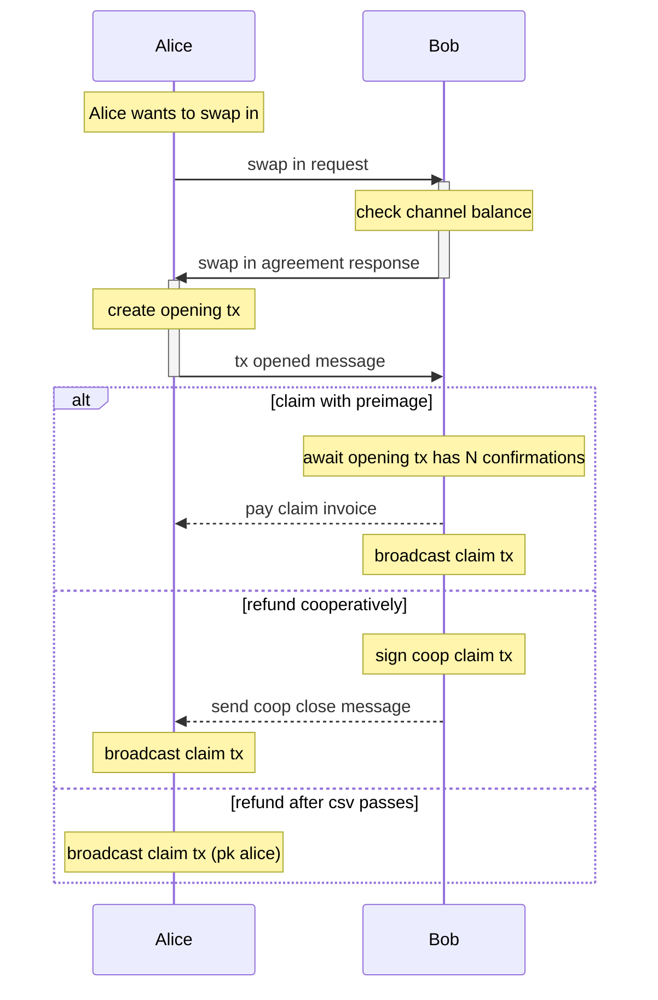

```mermaid
sequenceDiagram
participant A as Alice
participant B as Bob

Note over A: Alice wants to swap in

A->>B: swap in request
activate B
Note over B: check channel balance
B->>A: swap in agreement response
deactivate B
activate A
Note over A: create opening tx
A->>B: tx opened message
deactivate A
alt claim with preimage
Note over B: await opening tx has N confirmations
B-->>A: pay claim invoice
Note over B: broadcast claim tx
else refund cooperatively
Note over B: sign coop claim tx
B-->>A: send coop close message
Note over A: broadcast claim tx
else refund after csv passes
Note over A: broadcast claim tx (pk alice)
end
```