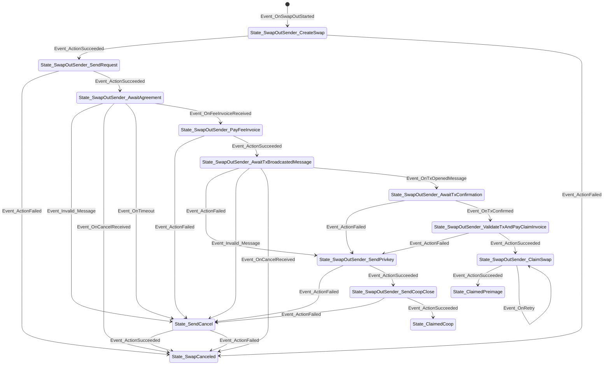

```mermaid
stateDiagram-v2
State_SwapOutSender_SendRequest
State_SwapOutSender_SendRequest --> State_SwapCanceled: Event_ActionFailed
State_SwapOutSender_SendRequest --> State_SwapOutSender_AwaitAgreement: Event_ActionSucceeded
State_ClaimedPreimage
State_SwapOutSender_AwaitTxConfirmation
State_SwapOutSender_AwaitTxConfirmation --> State_SwapOutSender_SendPrivkey: Event_ActionFailed
State_SwapOutSender_AwaitTxConfirmation --> State_SwapOutSender_ValidateTxAndPayClaimInvoice: Event_OnTxConfirmed
State_SwapOutSender_ValidateTxAndPayClaimInvoice
State_SwapOutSender_ValidateTxAndPayClaimInvoice --> State_SwapOutSender_SendPrivkey: Event_ActionFailed
State_SwapOutSender_ValidateTxAndPayClaimInvoice --> State_SwapOutSender_ClaimSwap: Event_ActionSucceeded
State_SwapCanceled
State_SwapOutSender_CreateSwap
State_SwapOutSender_CreateSwap --> State_SwapOutSender_SendRequest: Event_ActionSucceeded
State_SwapOutSender_CreateSwap --> State_SwapCanceled: Event_ActionFailed
State_SendCancel
State_SendCancel --> State_SwapCanceled: Event_ActionSucceeded
State_SendCancel --> State_SwapCanceled: Event_ActionFailed
State_SwapOutSender_PayFeeInvoice
State_SwapOutSender_PayFeeInvoice --> State_SendCancel: Event_ActionFailed
State_SwapOutSender_PayFeeInvoice --> State_SwapOutSender_AwaitTxBroadcastedMessage: Event_ActionSucceeded
State_SwapOutSender_ClaimSwap
State_SwapOutSender_ClaimSwap --> State_ClaimedPreimage: Event_ActionSucceeded
State_SwapOutSender_ClaimSwap --> State_SwapOutSender_ClaimSwap: Event_OnRetry
State_SwapOutSender_SendPrivkey
State_SwapOutSender_SendPrivkey --> State_SendCancel: Event_ActionFailed
State_SwapOutSender_SendPrivkey --> State_SwapOutSender_SendCoopClose: Event_ActionSucceeded
State_SwapOutSender_SendCoopClose
State_SwapOutSender_SendCoopClose --> State_SendCancel: Event_ActionFailed
State_SwapOutSender_SendCoopClose --> State_ClaimedCoop: Event_ActionSucceeded
[*] --> State_SwapOutSender_CreateSwap: Event_OnSwapOutStarted
State_SwapOutSender_AwaitAgreement
State_SwapOutSender_AwaitAgreement --> State_SendCancel: Event_Invalid_Message
State_SwapOutSender_AwaitAgreement --> State_SwapCanceled: Event_OnCancelReceived
State_SwapOutSender_AwaitAgreement --> State_SendCancel: Event_OnTimeout
State_SwapOutSender_AwaitAgreement --> State_SwapOutSender_PayFeeInvoice: Event_OnFeeInvoiceReceived
State_SwapOutSender_AwaitTxBroadcastedMessage
State_SwapOutSender_AwaitTxBroadcastedMessage --> State_SwapOutSender_SendPrivkey: Event_ActionFailed
State_SwapOutSender_AwaitTxBroadcastedMessage --> State_SendCancel: Event_Invalid_Message
State_SwapOutSender_AwaitTxBroadcastedMessage --> State_SwapCanceled: Event_OnCancelReceived
State_SwapOutSender_AwaitTxBroadcastedMessage --> State_SwapOutSender_AwaitTxConfirmation: Event_OnTxOpenedMessage
State_ClaimedCoop
```