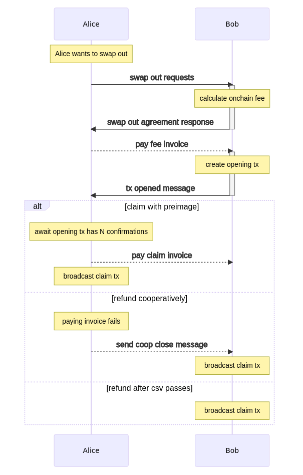

# Peer Protocol for PeerSwap Swaps

## Introduction

The PeerSwap protocol describes on-chain to off-chain atomic swaps between direct Lightning peers. A swap consists of two on-chain transactions: a opening transaction and a spending transaction. The opening transaction can be spent by revealing a payment preimage, received by paying a Lightning invoice. The primary use case of PeerSwap is efficient balancing of Lightning channels.

The key words "MUST", "MUST NOT", "REQUIRED", "SHALL", "SHALL NOT", "SHOULD", "SHOULD NOT", "RECOMMENDED",  "MAY", and "OPTIONAL" in this document are to be interpreted as described in [RFC 2119](#https://datatracker.ietf.org/doc/html/rfc2119).

## Table of Contents
- [Peer Protocol for PeerSwap Swaps](#peer-protocol-for-peerswap-swaps)
  - [Introduction](#introduction)
  - [Table of Contents](#table-of-contents)
  - [General](#general)
    - [Supported Chains](#supported-chains)
    - [Terminology Guide](#terminology-guide)
  - [Swap In](#swap-in)
    - [Summary](#summary)
    - [The Swap](#the-swap)
    - [Negotiation](#negotiation)
      - [The `swap_in_request` message](#the-swap_in_request-message)
        - [Requirements](#requirements)
      - [The `swap_in_agreement` message](#the-swap_in_agreement-message)
        - [Requirements](#requirements-1)
  - [Swap Out](#swap-out)
    - [Summary](#summary-1)
    - [The Swap](#the-swap-1)
    - [Negotiation](#negotiation-1)
      - [The `swap_out_request` message](#the-swap_out_request-message)
        - [Requirements](#requirements-2)
      - [The `swap_out_agreement` message](#the-swap_out_agreement-message)
        - [Requirements](#requirements-3)
  - [Doing the Swap](#doing-the-swap)
      - [The `opening_tx_broadcasted` message](#the-opening_tx_broadcasted-message)
        - [Requirements](#requirements-4)
  - [Failing a Swap](#failing-a-swap)
    - [Messages](#messages)
      - [The `cancel` message](#the-cancel-message)
        - [Requirements](#requirements-5)
      - [The `coop_close` message](#the-coop_close-message)
        - [Requirements](#requirements-6)
  - [Transactions](#transactions)
    - [CSV Times and Confirmations](#csv-times-and-confirmations)
      - [Timeouts and Invoice expiry](#timeouts-and-invoice-expiry)
    - [Opening Transaction](#opening-transaction)
      - [Opening Transaction Output](#opening-transaction-output)
    - [Claim transaction](#claim-transaction)
      - [The `claim_by_invoice` path](#the-claim_by_invoice-path)
      - [The `claim_by_coop` path](#the-claim_by_coop-path)
      - [The `claim_by_csv` path](#the-claim_by_csv-path)

## General
The `protocol_version` is included to allow for possible changes in the future. The `protocol_version` of this document is `6`.

PeerSwap utilizes custom messages as described in [BOLT#1](https://github.com/Lightning/bolts/blob/master/01-messaging.md). The types are in range `42069`-`42085`. The `payload` is JSON encoded.

* Both nodes MUST ignore unexpected Messages.
* During a swap the involved peers MUST ensure, that there is only one active swap per channel.
* Swaps are identified by a unique `swap_id` that MUST be mapped to the peers `pubkey` and MUST be checked on every message.
 
### Supported Chains
Currently PeerSwap supports atomic swaps via the following chains, both main and testnets:
* Bitcoin
* Liquid Network

### Terminology Guide
* #### Initiator
  * The peer requesting a swap.

* #### Responder
  * The peer participating in a swap requested by the Initiator.

* #### Maker
  * The peer that makes the on-chain commitment in the swap.

* #### Taker
  * The peer that pays the Lightning invoice in the swap.

* #### Swap In
  * A swap where the initiator is the maker, shifting Lightning balance towards itself.

* #### Swap Out
  * A swap where the initiator is the taker, shifting Lightning balance towards the Responder.


## Swap In
### Summary
```
                 Before                    Alice                     After
+-------+-------------------------------+ Swap In  +-------------------+-------------------+
|  0.2  |              0.8              | -------> |        0.5        |       0.5         |
+-------+-------------------------------+          +-------------------+-------------------+
 Alice                                Bob           Alice                                Bob

 0.5 btc                          0.5 btc           0.2 btc                          0.8 btc
 on-chain                         on-chain          on-chain                        on-chain
 ```
The aim of a `Swap In` is to shift the channel balance towards the initiators side. Therefore, the initiator asks its channel peer for a swap on the desired chain. If the peer agrees, the initiator publishes the [`opening transaction`](#opening-transaction) to the mempool and sends a Lightning invoice to the peer. Once the transaction has received enough confirmations, the responder pays the invoice and publishes the [`claim transaction`](#claim-transaction), revealing the preimage of the invoice to claim the transaction output of the opening transaction.

### The Swap


A swap in is initiated by the initiator (Alice) sending a [`swap_in_request` message](#the-swap_in_request-message) to the channel peer (Bob). Bob checks if the request is valid and if he can perform the swap. Bob then responds with the [`swap_in_agreement` message](#the-swap_in_agreement-message). Alice then broadcasts the [`opening_transaction`](#opening-transaction) and sends the [`opening_tx_broadcasted` message](#the-opening_tx_broadcasted-message) with an invoice back to Bob. After the [`opening_transaction`](#opening-transaction) is confirmed, Bob pays the invoice and can then broadcast the [`claim_transaction`](#claim-transaction) with the `preimage` to send the on-chain funds of the swap to an address of his desire. 

### Negotiation

This phase of the swap is used to agree on the swap conditions.
#### The `swap_in_request` message
1. `type`: 42069
2. `payload` json encoded:
   
```
{
  protocol_version: uint64,
  swap_id: string,
  network: string,
  asset_id: string,
  scid: string,
  ln_amount_sat: uint64,
  asset_amount: uint64,
  pubkey: string,
  acceptable_premium: int64
}
```

`protocol_version` is the version of the PeerSwap peer protocol the sending node uses.

`swap_id` is a randomly generated 32 byte string that must be kept the same through the whole process of a swap and serves as an identifier for a specific swap.

`network` is the desired on-chain network to use. This can be:
* Bitcoin: `mainnet`, `testnet3`, `testnet4`, `signet`, `regtest`
* Liquid: `liquid`, `liquid-testnet`, `liquid-regtest`

`asset_id` is the desired on-chain asset id to use:
* Bitcoin: MUST be left blank.
* Liquid: MUST be set to a 32-byte hex encoded asset id (big-endian as commonly displayed).

`scid` is the short channel id in human readable format, defined by [BOLT#7](https://github.com/Lightning/bolts/blob/master/07-routing-gossip.md) with `x` as separator, i.e. `539268x845x1`.

`ln_amount_sat` is the amount in satoshis on the Lightning side (BTC).

`asset_amount` is the amount in the on-chain asset base units.

`pubkey` is a 33 byte compressed public key generated by the swap initiator. It is used for the spending paths in the [`opening_transaction`](#opening-transaction).

`acceptable_premium` is the maximum premium (in sats) the sender is willing to accept. In protocol v6 MVP this is currently unused and peers are expected to set `premium=0`.

##### Requirements

The sending node (swap [maker](#maker)/[initiator](#initiator)):
* MUST set the `protocol_version` to the version the implementation it is using (v6).
* MUST ensure the `swap_id` is unique from any other swap the node has participated in.
* MUST set `network` to the on-chain network name.
* If requesting a swap on a Bitcoin network:
  * MUST leave `asset_id` blank.
* If requesting a swap on a Liquid network:
  * MUST set `asset_id` to the on-chain asset being swapped.
* MUST set `ln_amount_sat` and `asset_amount` greater than 0.
* MUST ensure `ln_amount_sat` is smaller than or equal to the channel size.
* SHOULD ensure that it can spend the asked `asset_amount` on the desired `network` and `asset_id` from the on-chain wallet (and can fund LBTC fees for Liquid).
* MUST set the `scid` in desired format for an existing channel between the peers.
* SHOULD use a fresh random private key to generate the `pubkey` per swap request.
* MUST set a 33 byte sized `pubkey` for the receiving node to build the swap bitcoin script in order to verify the broadcasted [`opening transaction`](#opening-transaction).
* SHOULD [fail the swap](#failing-a-swap) after a reasonable time without receiving an answer.

The receiving node (swap [taker](#taker)/[responder](#responder)):
* MUST [fail the swap](#failing-a-swap) on an incompatible `protocol_version`.
* MUST [fail_the_swap](#failing-a-swap) if the `swap_id` is already used
* MUST [fail the swap](#failing-a-swap) if it does not support the asked `network`.
* If `network` is a Bitcoin network:
  * MUST [fail the swap](#failing-a-swap) if `asset_id` is set.
* If `network` is a Liquid network:
  * MUST [fail the swap](#failing-a-swap) if `asset_id` is missing or invalid.
* MUST [fail the swap](#failing-a-swap) if the `ln_amount_sat` exceeds channel size.
* MUST [fail the swap](#failing-a-swap) if the channel with `scid` does not exist to the peer.
* MUST keep the [`swap_in_request` message](#the-swap_in_request-message) field values for later use.

#### The `swap_in_agreement` message
  1. `type`: 42073
  2. `payload` json encoded:
```
{
  protocol_version: uint64,
  swap_id: string,
  pubkey: string,
  premium: int64
}
```

`protocol_version` is the version of the PeerSwap peer protocol the sending node uses.

`swap_id` is the unique identifier of the swap.

`pubkey` is a 33 byte compressed public key generated by the swap responder. It is used for the spending paths in the [`opening_transaction`](#opening-transaction).

`premium` is a compensation in sats that the swap partner wants to be paid in order to participate in the swap. In protocol v6 MVP, premium is currently disabled and peers are expected to set `premium=0`.

##### Requirements

The sending node (swap [taker](#taker)/[responder](#responder)):
* MUST set the swap_id to the `swap_id` received from the `swap_in_request` message.
* MUST set a 33 byte sized `pubkey` for the maker node to build the bitcoin script for the [`opening transaction`](#opening-transaction).
* SHOULD use a fresh random private key to generate the `pubkey`.
* SHOULD [fail the swap](#failing-a-swap) after a reasonable time without receiving an answer.
* SHOULD set `premium=0` (protocol v6 MVP).

The receiving node (swap [maker](#maker)/[initiator](#initiator)):
* MUST [fail the swap](#failing-a-swap) on an incompatible protocol_version.
* MUST ignore the message if the `swap id` is unknown.
* MUST keep the `pubkey` for later use in the case of a [failing swap](#failing-a-swap).
* SHOULD treat `premium` as informational only and expect `premium=0` for protocol v6 MVP.
* MUST NOT add `premium` to the on-chain amount of the [`opening_transaction`](#opening-transaction) in protocol v6 MVP.

The next steps are the same for both kind of swaps and are laid out under [Doing the Swap](#doing-the-swap).
  
## Swap Out
### Summary
```
                 Before                    Alice                     After
+-------------------------------+-------+ Swap Out +-------------------+-------------------+
|              0.8              |  0.2  | -------> |        0.5        |       0.5         |
+-------------------------------+-------+          +-------------------+-------------------+
 Alice                                Bob           Alice                                Bob

 0.5 btc                          0.5 btc           0.8 btc                          0.2 btc
 on-chain                         on-chain          on-chain                        on-chain
```
The aim of a `Swap Out` is to shift the channel balance towards the responders side. Therefore, the initiator asks its channel peer for a swap on the desired chain. If the responder agrees, it responds with a fee invoice to cover the on-chain fees for claiming the on-chain funds, in case the initiator does not pay the later swap invoice. When the initiator pays the fee invoice, the responder broadcasts the [`opening transaction`](#opening-transaction) to the mempool and sends a Lightning invoice to the initiator. Once the transaction has enough confirmations, the initiator pays the invoice and creates the [`claim transaction`](#claim-transaction) with the preimage.

### The Swap


### Negotiation

This phase of the swap is used to agree on the swap conditions. It involves one more invoice than the swap in negotiation, to compensate for the on-chain fees the swap responder and maker in this case has to account for.
#### The `swap_out_request` message
  1. `type`: 42071
  2. `payload` json encoded:
```
{
  protocol_version: uint64,
  swap_id: string,
  network: string,
  asset_id: string,
  scid: string,
  ln_amount_sat: uint64,
  asset_amount: uint64,
  pubkey: string,
  acceptable_premium: int64
}
```
`protocol_version` is the version of the PeerSwap peer protocol the sending node uses.

`swap_id` is a randomly generated 32 byte string, that must be kept the same through the whole process of a swap and serves as an identifier for a specific swap.

`network` is the desired on-chain network to use. This can be:
* Bitcoin: `mainnet`, `testnet3`, `testnet4`, `signet`, `regtest`
* Liquid: `liquid`, `liquid-testnet`, `liquid-regtest`

`asset_id` is the desired on-chain asset id to use:
* Bitcoin: MUST be left blank.
* Liquid: MUST be set to a 32-byte hex encoded asset id (big-endian as commonly displayed).

`scid` is the short channel id in human readable format, defined by [BOLT#7](https://github.com/Lightning/bolts/blob/master/07-routing-gossip.md) with `x` as separator, i.e. `539268x845x1`.

`ln_amount_sat` is the amount in satoshis on the Lightning side (BTC).

`asset_amount` is the amount in the on-chain asset base units.

`pubkey` is a 33 byte compressed public key generated by the initiator. It is used for the spending paths in the [`opening_transaction`](#opening-transaction).

`acceptable_premium` is the maximum premium (in sats) the sender is willing to accept. In protocol v6 MVP this is currently unused and peers are expected to set `premium=0`.

##### Requirements

The sending node (swap [taker](#taker)/[initiator](#initiator)):
* MUST set the `protocol_version` to the version the implementation it is using (v6).
* MUST ensure the `swap_id` is unique from any other swap the node has participated in.
* MUST set `network` to the on-chain network name.
* If requesting a swap on a Bitcoin network:
  * MUST leave `asset_id` blank.
* If requesting a swap on a Liquid network:
  * MUST set `asset_id` to the on-chain asset being swapped.
* MUST set `ln_amount_sat` and `asset_amount` greater than 0.
* MUST set `ln_amount_sat` smaller than or equal to the capacity of the channel.
* MUST set the `scid` in desired format for an existing channel between the peers.
* SHOULD use a fresh random private key to generate the `pubkey` per swap request.
* MUST set a 33 byte sized compressed `pubkey` for the receiving node to build the swap bitcoin script in order to verify the broadcasted [`opening transaction`](#opening-transaction).
* SHOULD [fail the swap](#failing-a-swap) after a reasonable time without receiving an answer.

The receiving node (swap responder):
* MUST [fail the swap](#failing-a-swap) on an incompatible `protocol_version`.
* MUST [fail_the_swap](#failing-a-swap) if the `swap_id` is already used.
* MUST [fail the swap](#failing-a-swap) if it does not support the asked `network`.
* If `network` is a Bitcoin network:
  * MUST [fail the swap](#failing-a-swap) if `asset_id` is set.
* If `network` is a Liquid network:
  * MUST [fail the swap](#failing-a-swap) if `asset_id` is missing or invalid.
* MUST [fail the swap](#failing-a-swap) if the `ln_amount_sat` exceeds channel size.
* SHOULD ensure that it can dispose the asked `asset_amount` on the desired `network` and `asset_id` from the on-chain wallet (and can fund LBTC fees for Liquid).
* MUST [fail the swap](#failing-a-swap) if the channel with `scid` does not exist to the peer.
* MUST keep the [`swap_out_request` message](#the-swap_out_request-message) field values for later use.

#### The `swap_out_agreement` message
  1. `type`: 42075
  2. `payload` json encoded:
```
{
  protocol_version: uint64,
  swap_id: string,
  pubkey: string,
  payreq: string,
  premium: int64
}
```

`protocol_version` is the version of the PeerSwap peer protocol the sending node uses.

`swap_id` is the unique identifier of the swap.

`pubkey` is a 33 byte compressed public key generated by the responder. It is used by the initiator to build the bitcoin script in order to verify the [`opening_transaction`](#opening-transaction).

`payreq` is a [BOLT#11](#https://github.com/Lightning/bolts/blob/master/11-payment-encoding.md) invoice with an amount that covers the fee expenses for the on-chain transactions.

`premium` is a compensation in sats that the swap partner wants to be paid in order to participate in the swap. In protocol v6 MVP, premium is currently disabled and peers are expected to set `premium=0`.

##### Requirements

The sending node (swap [maker](#maker)/[responder](#responder)):
* MUST set the `protocol_version` to the version the implementation is using.
* MUST set the swap_id to the `swap_id` received from the `swap_out_request` message.
* SHOULD use a fresh random private key to generate the `pubkey`.
* MUST set a 33 byte sized `pubkey` for the taker node to build the swap bitcoin script for verification of the [`opening transaction`](#opening-transaction).
* MUST set `payreq` to a valid [BOLT#11](#https://github.com/Lightning/bolts/blob/master/11-payment-encoding.md) invoice
* SHOULD set the `amount` of the invoice to the fee of the to be created [`opening_transaction`](#opening-transaction).
* SHOULD resend the message periodically until one of the following is true:
  * fee invoice with `payreq` has been paid.
  * fee invoice with `payreq` expired, in this case MUST [fail the swap](#failing-a-swap).
  * received a [`cancel`](#the-cancel-message) or [`coop_close`](#the-coop_close-message) message.
* SHOULD set `premium=0` (protocol v6 MVP).

The receiving node (swap initiator):
* MUST [fail the swap](#failing-a-swap) on an incompatible `protocol_version`.
* MUST ignore the message if the `swap_id` is unknown.
* MUST [fail the swap](#failing-a-swap) if `payreq` is not a valid [BOLT#11](#https://github.com/Lightning/bolts/blob/master/11-payment-encoding.md) invoice;
* SHOULD [fail the swap](#failing-a-swap) if the `amount` asked for in the `payreq` is exceeding own expectations.
* MUST [fail the swap](#failing-a-swap) if the `amount` asked for in the `payreq` added to the `amount` asked for in the [`swap_out_request`](#the-swap_out_request-message) exceeds the peers channel balance.
* MUST try to pay the fee invoice and [fail the swap](#failing-a-swap) if this fails.
* if the `premium` exceeds its expectations:
  * MUST [fail_the_swap](#failing-a-swap)

When the fee invoice was paid, the next steps are the same for both kind of swaps and are laid out under Doing the Swap. 

## Doing the Swap

After the peers agreed to the swap conditions, the `swap maker` broadcasts the [`opening_transaction`](#opening-transaction) and sends the [`opening_tx_broadcasted` message](#the-opening_tx_broadcasted-message) to the `swap taker`.

#### The `opening_tx_broadcasted` message
  1. `type`: 42077
  2. `payload` json encoded:
```
{
  swap_id: string,
  payreq: string,
  tx_id: string,
  script_out: uint64,
  blinding_key: string,
}
```
`swap_id` is the unique identifier of the swap.

`payreq` is the invoice as described in [BOLT#11](#https://github.com/Lightning/bolts/blob/master/11-payment-encoding.md) that the responder is requested to pay.

`tx_id` is the transaction id of the [`opening_transaction`](#opening-transaction) broadcasted by the initiator.

`script_out` is the transaction output that contains the [`opening_transaction`](#opening-transaction) output script for the swap.

`blinding_key`:
  * Bitcoin: Blank.
  * Liquid Network: Is the 32 byte blinding key to un-blind the outputs of the [`opening_transaction`](#opening-transaction).

##### Requirements

The sending node (swap maker):
* MUST set `swap_id` matching the ongoing swap.
* MUST set `payreq` to a valid [BOLT#11](#https://github.com/Lightning/bolts/blob/master/11-payment-encoding.md) invoice with the amount that was requested in `ln_amount_sat` of the swap request and the payment_hash of the [`opening_transaction`](#opening-transaction) and a [reasonable `expiry`](#timeouts-and-invoice-expiry).
* MUST set `tx_id` to the id of the broadcasted [`opening_transaction`](#opening-transaction).
* MUST set `script_out` to the output index that contains the script for the [`opening_transaction`](#opening-transaction)
* if the swap uses a Liquid `network`:
  * MUST set the `blinding_key` to the blinding key that is used to unblind the `opening_transaction` outputs.
* if the swap uses a Bitcoin `network`:
  * MUST NOT set the `blinding_key`.
* SHOULD fail any htlc that would change the channel into a state, where the swap invoice can not be paid until the swap invoice was paid.
* SHOULD resend the message until one of the following is true:
  * swap invoice with `payreq` has been paid.
  * swap invoice with `payreq` expired, in this case MUST [fail the swap](#failing-a-swap).
  * received a [`cancel`](#the-cancel-message) or [`coop_close`](#the-coop_close-message) message.
* if the invoice with `payreq` gets paid:
  * MUST consider the swap finished and ignore all future messages with `swap_id`.
* otherwise after the invoice is expired:
  * MUST [fail the swap](#failing-a-swap).

The receiving node (swap taker):
* MUST [fail the swap](#failing-a-swap) if the `swap_id` changed.
* MUST check that the `payreq` amount matches the negotiated `ln_amount_sat` of the swap and [fail the swap](#failing-a-swap) if not.
* SHOULD fail any htlc that would change the channel into a state, where the swap invoice can not be paid until the swap invoice was paid.
* MUST wait for the [opening_transaction](#opening-transaction) with `tx_id` to be confirmed.
* MUST verify the [opening_transaction](#opening-transaction) output with index `script_out` (the swap-asset output):
  * MUST check that the script is built as described by [opening_transaction](#opening-transaction).
  * if the swap uses a Liquid `network`:
    * MUST unblind the outputs with `blinding_key`.
    * MUST check that the output at `script_out` has the negotiated `asset_id` and `asset_amount`.
    * MUST check that there is an additional LBTC fee-reserve output locked to the same swap script, sufficient to pay the spending transaction fee.
  * if the swap uses a Bitcoin `network`:
    * MUST check that the output amount matches the negotiated `asset_amount` (in sats).
* if this fails:
  * MUST [fail the swap](#failing-a-swap).
* otherwise:
  * MUST pay the swap invoice over the channel with the negotiated `scid`.
    * if this fails:
      * SHOULD retry to pay the invoice, but MUST NOT pay the invoice if current block height exceeds `CONFIRMATION_HEIGHT + R/2`, where `CONFIRMATION_HEIGHT` is the height of the block at which the [`opening_transaction`](#opening-transaction) counts as [confirmed](#csv-times-and-confirmations), and `R` is the relative locktime of the `claim_by_csv` path of the [`opening_transaction`](#opening-transaction).
      * if this fails:
        * MUST  [fail the swap](#failing-a-swap).
    * otherwise:
      * MUST broadcast the `claim_by_preimage`[`claim_transaction`](#claim-transaction) with a fee high enough to ensure that the transaction is confirmed before the `claim_by_csv` spending path is possible.
      * MUST consider the swap finished after the [`claim_transaction`](#claim-transaction) has been confirmed.

## Failing a Swap
When a node cancels a swap, the most effective way should be used to avoid unnecessary long on-chain locks for the swap partner. This means that if the swap fails after the [`opening_transaction`](#opening-transaction) was broadcasted (e.g. because the invoice can not be paid), the swap taker should be cooperative and fail the swap via the [`coop_close` message](#the-coop_close-message).

Both nodes MUST expect `cancel` and `coop_close` at any time during an active swap.

### Messages

#### The `cancel` message
  1. `type`: 42079
  2. `payload` json encoded:
```
{
  swap_id: string,
  message: string,
}
```
`swap_id` is the unique identifier of the swap.

`message` is a hint to why the swap was canceled.
##### Requirements

The sending node:
* MUST set `swap_id` matching the ongoing swap.
* SHOULD set a meaningful `message`.
* MUST consider the swap canceled and ignore all future messages with `swap_id`.
* if it is the `swap maker` and the [`opening_transaction`](#opening-transaction) was already broadcasted:
    * MUST broadcast the [`claim_transaction`](#claim-transaction), with the `claim_by_csv` spending path, after the CSV has passed.
    * MUST allow for new swaps on the channel as soon as the [`claim_transaction`](#claim-transaction) is confirmed. 
* otherwise:
  * MUST allow for new swaps on the channel.

The receiving node:
* MUST consider the swap canceled and ignore all future messages with `swap_id`.
* if it is the `swap maker` and the [`opening_transaction`](#opening-transaction) was already broadcasted:
     * MUST broadcast the [`claim_transaction`](#claim-transaction), with the `claim_by_csv` spending path, after the CSV has passed.
     * MUST allow for new swaps on the channel as soon as the [`claim_transaction`](#claim-transaction) is confirmed.
* otherwise:
    * MUST allow for new swaps on the channel.

#### The `coop_close` message
  1. `type`: 42081
  2. `payload` json encoded:
```
{
  swap_id: string,
  message: string,
  privkey: string,
}
```
`swap_id` is the unique identifier of the swap.

`message` is a hint to why the swap was closed cooperatively.

`privkey` is the private key to the pubkey that is used to build the [`opening_transaction`](#opening-transaction).

##### Requirements
The sending node (swap taker):
* MUST set `swap_id` matching the ongoing swap.
* SHOULD set a meaningful `message`.
* if the node is the initiator:
  * MUST set `privkey` to the random private key that was used to generate the pubkey that was set in the request message.
* otherwise:
  * MUST set `privkey` to the random private key that was used to generate the pubkey that was set in the agreement message.

The receiving node (swap maker):
* if the [`opening_transaction`](#opening-transaction) was already broadcasted:
    * MUST consider the swap canceled and ignore all future messages with `swap_id`.
    * MUST broadcast the [`claim_transaction`](#claim-transaction) with the `claim_by_coop` spending path using the `privkey`.
    * if this fails:
      * MUST broadcast the [`claim_transaction`](#claim-transaction) with the `claim_by_csv` spending path, after the CSV has passed.
* otherwise:
  * MUST consider this to be a [`cancel` message](#the-cancel-message).

## Transactions
### CSV Times and Confirmations
Timings are critical to the PeerSwap protocol. The goal is to provide a safe swap while maintaining a reasonable time frame. The timings differ for the supported networks.

In the case of Bitcoin:
* CSV = 1008
* Min required confirmations for the [`opening_transaction`](#opening-transaction) = 3

In The case of Liquid:
* CSV = 60
* Min required confirmations for the [`opening_transaction`](#opening-transaction) = 2

The difference in timings is due to the different fee and consensus models of the Liquid Network and Bitcoin.

#### Timeouts and Invoice expiry

The expiry of the `swap invoice` MUST be less than or equal to half the CSV time to ensure a secure swap.

### Opening Transaction
The opening transaction has a pay-to-witness-script-hash<sup>[BIP141](https://github.com/bitcoin/bips/blob/master/bip-0141.mediawiki#witness-program)</sup> (P2WSH) output that locks the on-chain part of the swap. This script has three different spending paths. These are the `claim_by_invoice`, `claim_by_csv` and the `claim_by_coop` paths. The transaction maker may use inputs to his desire.

If this is a Liquid transaction, it MUST be blinded.

For protocol v6 Liquid swaps (arbitrary `asset_id`), the opening transaction includes an additional LBTC fee-reserve output locked to the same swap script. This reserve is used to pay the fee of the spending transaction so that the swapped asset amount (`asset_amount`) does not need to be reduced by fees.

#### Opening Transaction Output
* The opening transaction policy:
```
or(and(pk(A),or(pk(B),sha256(H))),and(pk(B),older(144)))
```
* The opening transaction output script is a P2WSH:
```
<B> OP_CHECKSIG OP_NOTIF
  <B> OP_CHECKSIG OP_NOTIF
    OP_SIZE <20> OP_EQUALVERIFY OP_SHA256 <H> OP_EQUALVERIFY
  OP_ENDIF
  <A> OP_CHECKSIG
OP_ELSE
  <N> OP_CHECKSEQUENCEVERIFY
OP_ENDIF
```
With:
* `<A>` the pubkey of the [`taker`](#taker)
* `<B>` the pubkey of the [`maker`](#maker)
* `<H>` the payment_hash
* `<N>` the number of confirmations before the refund to the maker is possible. See [CSV Times](#csv-times-and-confirmations)

### Claim transaction
The claim transaction finishes the atomic swap.
There are three different variants for the claiming transaction, depending on how the swap finishes.

#### The `claim_by_invoice` path
This is the desired way to finish a swap. The taker sends the funds to its address by revealing the preimage of the swap invoice.

* txin count:
  * Bitcoin: 1
  * Liquid: 2 (swap-asset output + LBTC fee-reserve output, both locked to the same script)
* txin[0] outpoint: `tx_id` and `script_output` from the `opening_tx_broadcasted` message (swap-asset output)
* txin[0] sequence: 0
* txin[0] script bytes: 0
* txin[0] witness: `<signature_for_A> <preimage> <> <> <redeem_script>`
* txin[1] (Liquid only):
  * outpoint: the LBTC fee-reserve output in the `opening_transaction`
  * sequence: 0
  * script bytes: 0
  * witness: `<signature_for_A> <preimage> <> <> <redeem_script>` (with a signature for txin[1])


#### The `claim_by_coop` path
This is the way to cooperatively finish a swap. The maker refunds to its address without waiting for the CSV.

* txin count:
  * Bitcoin: 1
  * Liquid: 2 (swap-asset output + LBTC fee-reserve output)
* txin[0] outpoint: `tx_id` and `script_output` from the `opening_tx_broadcasted` message (swap-asset output)
* txin[0] sequence: 0
* txin[0] script bytes: 0
* txin[0] witness: `<signature_for_A> <signature_for_B> <> <redeem_script>`
* txin[1] (Liquid only):
  * outpoint: the LBTC fee-reserve output in the `opening_transaction`
  * sequence: 0
  * script bytes: 0
  * witness: `<signature_for_A> <signature_for_B> <> <redeem_script>` (with signatures for txin[1])

#### The `claim_by_csv` path
This is the way to finish a swap if the invoice was not paid and the taker did not send a `coop_close` message. After the relative locktime has passed, the maker refunds to them.

* txin count:
  * Bitcoin: 1
  * Liquid: 2 (swap-asset output + LBTC fee-reserve output)
* txin[0] outpoint: `tx_id` and `script_output` from the `opening_tx_broadcasted` message (swap-asset output)
* txin[0] sequence:
  * for Bitcoin: 0x3F0 corresponding to the CSV of 1008
  * for Liquid: 0x3C corresponding to the CSV of 60
* txin[0] script bytes: 0
* txin[0] witness: `<signature_for_B> <redeem_script>`
* txin[1] (Liquid only):
  * outpoint: the LBTC fee-reserve output in the `opening_transaction`
  * sequence: 0x3C corresponding to the CSV of 60
  * script bytes: 0
  * witness: `<signature_for_B> <redeem_script>` (with a signature for txin[1])
