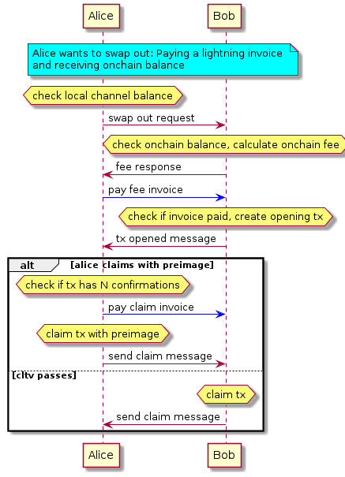
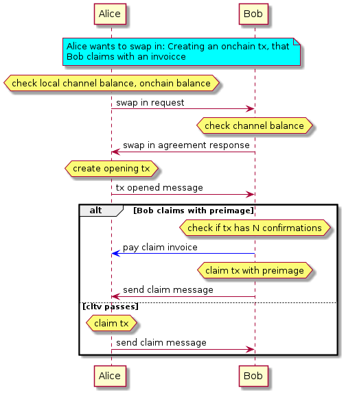

# PeerSwap Protocol

- [PeerSwap Protocol](#peerswap-protocol)
  - [Diagrams](#diagrams)
    - [Swap out](#swap-out)
    - [Swap in](#swap-in)
  - [Messages](#messages)
    - [Swap out request](#swap-out-request)
    - [Swap in request](#swap-in-request)
    - [Swap in agreement response](#swap-in-agreement-response)
    - [Fee response](#fee-response)
    - [Tx opened response](#tx-opened-response)
    - [Claim message](#claim-message)
    - [Cancel message](#cancel-message)
  - [Notes](#notes)
    - [Premiums](#premiums)
    - [Opening Transaction](#opening-transaction)
    - [Misc](#misc)
  
## Diagrams

### Swap out



### Swap in



## Messages

### Swap out request

```go
{
  SwapId: string // Random string that is shared between peers
  ChannelId: string // chhannelId of rebalanced channel
  Amount: uint64  // amount to be swapped (in msats)
  PubkeyHash: string  // Taker PubkeyHash, for creating/verifying the bitcoin script
}
```

### Swap in request

```go
{
  SwapId: string
  ChannelId: string // chhannelId of rebalanced channel
  Amount: uint64  // amount to be swapped (in msats)
  PubkeyHash: string  // Maker PubkeyHash, for creating/verifying the bitcoin script
}
```

### Swap in agreement response

```go
{
  SwapId: string
  PubkeyHash: string // Taker PubkeyHash, for creating/verifying the bitcoin script
  Premium: uint64 // Premium that bob wants in order to accept the swap
}
```

### Fee response

```go
{
  SwapId: string 
  Invoice: string  // Bolt11 string of fee invoice
  Premium: uint64 // Premium that bob wants in order to accept the swap
}
```

### Tx opened response

```go
{
  SwapId: string 
  PubkeyHash: string // Maker pubkey hash, for verifying the bitcoin script
  Payreq: string // Invoice that claims the transaction
  TxId: string // TxId of broadcasted commitment transaction
}
```

### Claim message

```go
{
  SwapId: string 
  TxId:  string // TxId of claim transaction
}
```

### Cancel message

```go
{
  SwapId: string
  Msg: string // Some information why the swap was canceled
}
```

## Notes

### Premiums

The Premiums are an incentive for the peer in order to accept an eventual locking of funds.

When swapping out the premium is added by bob on the claming invoice

When swapping in the premium is added by alice on the opening transaction

### Opening Transaction

```bash
#Miniscript:
or(and(pk(A),sha256(H)),and(pk(B),older(N)))

# Bitcoin/Elements script
<A> OP_CHECKSIG OP_NOTIF
  <B> OP_CHECKSIGVERIFY <N> OP_CHECKSEQUENCEVERIFY
OP_ELSE
  OP_SIZE <20> OP_EQUALVERIFY OP_SHA256 <H> OP_EQUAL
OP_ENDIF

```

### Misc

- Taker is the one claiming the commitment transaction
- Maker the one creating it and providing lbtc liquidity
- Swap In means paying lbtc to get sats
- Swap Out means paying an invoice to get lbtc
