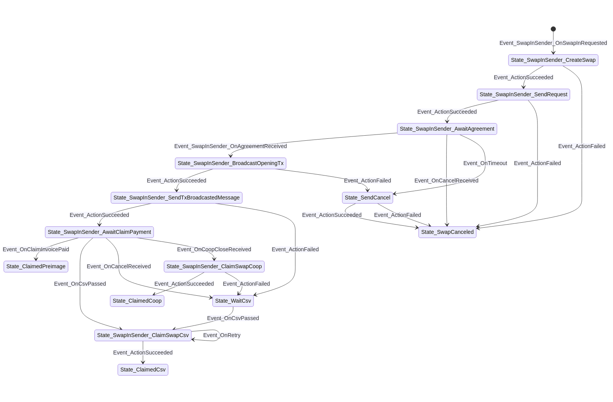
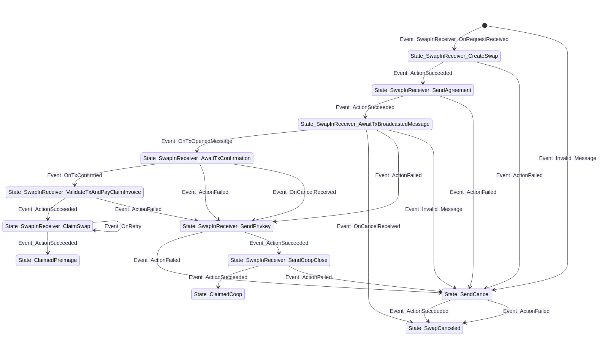
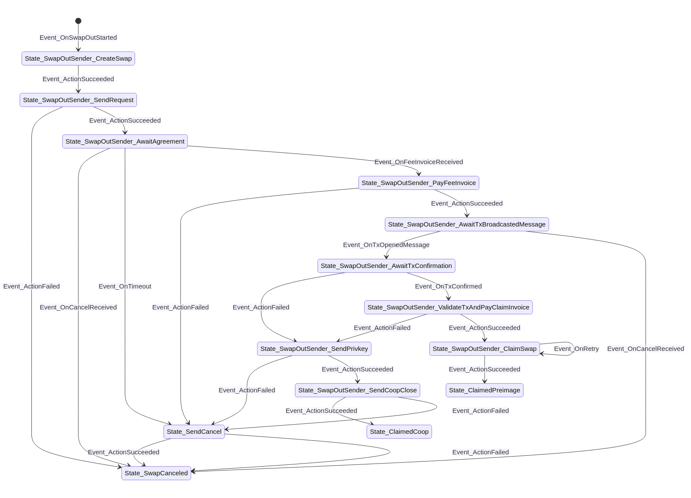
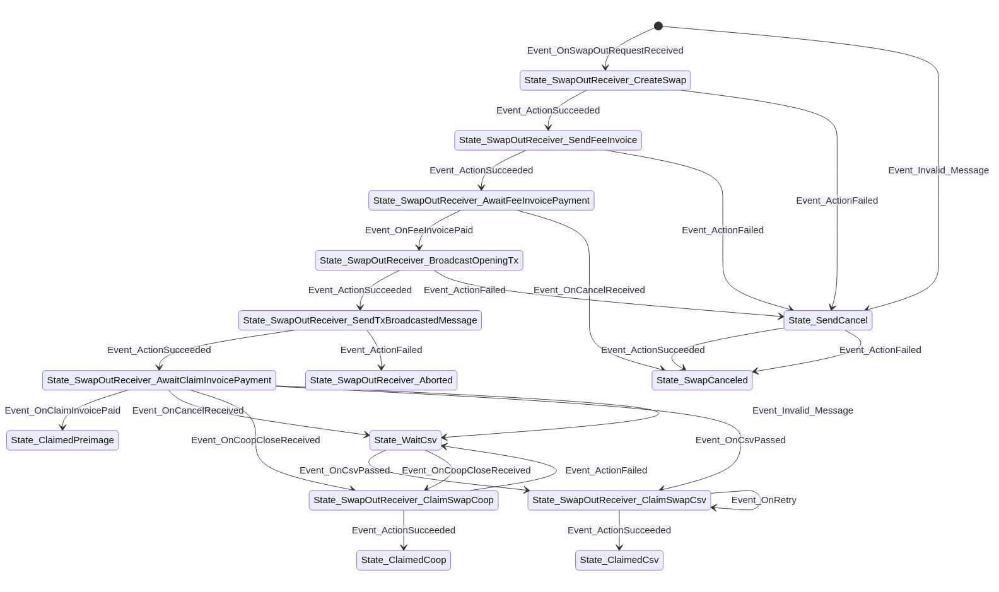

# States

- [States](#states)
  - [Swap-in Sender](#swap-in-sender)
  - [Swap-in Receiver](#swap-in-receiver)
  - [Swap-out Sender](#swap-out-sender)
  - [Swap-out Receiver](#swap-out-receiver)

## Swap-in Sender

## Swap-in Receiver

## Swap-out Sender

## Swap-out Receiver

