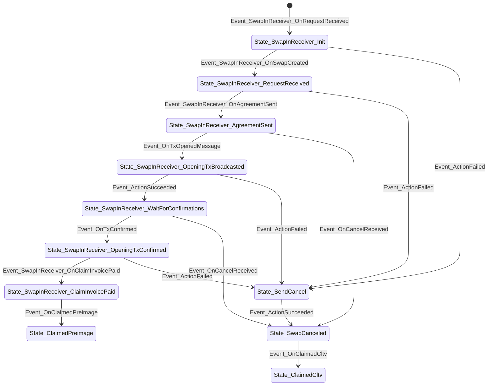

```mermaid
stateDiagram-v2
State_SwapInReceiver_RequestReceived
State_SwapInReceiver_RequestReceived --> State_SwapInReceiver_AgreementSent: Event_SwapInReceiver_OnAgreementSent
State_SwapInReceiver_RequestReceived --> State_SendCancel: Event_ActionFailed
State_SwapInReceiver_AgreementSent
State_SwapInReceiver_AgreementSent --> State_SwapInReceiver_OpeningTxBroadcasted: Event_OnTxOpenedMessage
State_SwapInReceiver_AgreementSent --> State_SwapCanceled: Event_OnCancelReceived
State_SwapInReceiver_OpeningTxBroadcasted
State_SwapInReceiver_OpeningTxBroadcasted --> State_SwapInReceiver_WaitForConfirmations: Event_ActionSucceeded
State_SwapInReceiver_OpeningTxBroadcasted --> State_SendCancel: Event_ActionFailed
State_SwapInReceiver_WaitForConfirmations
State_SwapInReceiver_WaitForConfirmations --> State_SwapInReceiver_OpeningTxConfirmed: Event_OnTxConfirmed
State_SwapInReceiver_WaitForConfirmations --> State_SwapCanceled: Event_OnCancelReceived
State_SwapInReceiver_OpeningTxConfirmed
State_SwapInReceiver_OpeningTxConfirmed --> State_SwapInReceiver_ClaimInvoicePaid: Event_SwapInReceiver_OnClaimInvoicePaid
State_SwapInReceiver_OpeningTxConfirmed --> State_SendCancel: Event_ActionFailed
State_ClaimedCltv
State_ClaimedPreimage
State_SwapInReceiver_Init
State_SwapInReceiver_Init --> State_SwapInReceiver_RequestReceived: Event_SwapInReceiver_OnSwapCreated
State_SwapInReceiver_Init --> State_SendCancel: Event_ActionFailed
State_SendCancel
State_SendCancel --> State_SwapCanceled: Event_ActionSucceeded
State_SwapInReceiver_ClaimInvoicePaid
State_SwapInReceiver_ClaimInvoicePaid --> State_ClaimedPreimage: Event_OnClaimedPreimage
State_SwapCanceled
State_SwapCanceled --> State_ClaimedCltv: Event_OnClaimedCltv
[*] --> State_SwapInReceiver_Init: Event_SwapInReceiver_OnRequestReceived
```