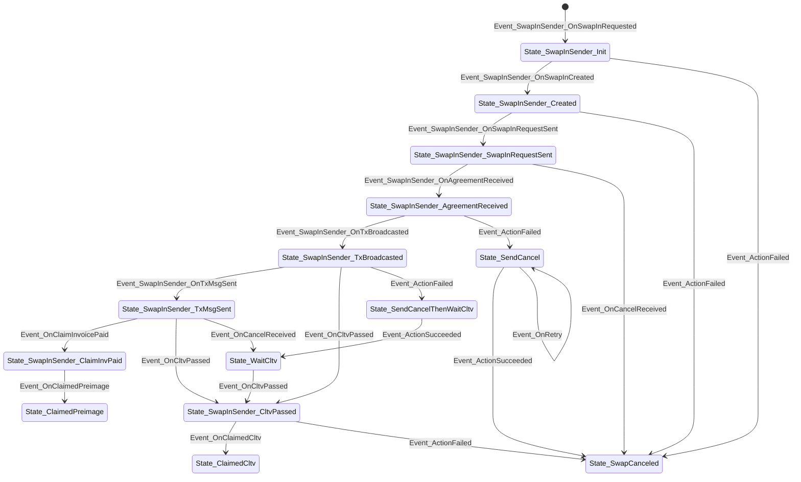

```mermaid
stateDiagram-v2
State_SwapInSender_TxBroadcasted
State_SwapInSender_TxBroadcasted --> State_SwapInSender_TxMsgSent: Event_SwapInSender_OnTxMsgSent
State_SwapInSender_TxBroadcasted --> State_SwapInSender_CltvPassed: Event_OnCltvPassed
State_SwapInSender_TxBroadcasted --> State_SendCancelThenWaitCltv: Event_ActionFailed
State_SwapInSender_CltvPassed
State_SwapInSender_CltvPassed --> State_ClaimedCltv: Event_OnClaimedCltv
State_SwapInSender_CltvPassed --> State_SwapCanceled: Event_ActionFailed
State_SendCancelThenWaitCltv
State_SendCancelThenWaitCltv --> State_WaitCltv: Event_ActionSucceeded
State_ClaimedPreimage
State_ClaimedCltv
[*] --> State_SwapInSender_Init: Event_SwapInSender_OnSwapInRequested
State_SwapInSender_Init
State_SwapInSender_Init --> State_SwapInSender_Created: Event_SwapInSender_OnSwapInCreated
State_SwapInSender_Init --> State_SwapCanceled: Event_ActionFailed
State_SwapInSender_TxMsgSent
State_SwapInSender_TxMsgSent --> State_SwapInSender_ClaimInvPaid: Event_OnClaimInvoicePaid
State_SwapInSender_TxMsgSent --> State_SwapInSender_CltvPassed: Event_OnCltvPassed
State_SwapInSender_TxMsgSent --> State_WaitCltv: Event_OnCancelReceived
State_SendCancel
State_SendCancel --> State_SwapCanceled: Event_ActionSucceeded
State_SendCancel --> State_SendCancel: Event_OnRetry
State_SwapInSender_ClaimInvPaid
State_SwapInSender_ClaimInvPaid --> State_ClaimedPreimage: Event_OnClaimedPreimage
State_SwapCanceled
State_SwapInSender_SwapInRequestSent
State_SwapInSender_SwapInRequestSent --> State_SwapInSender_AgreementReceived: Event_SwapInSender_OnAgreementReceived
State_SwapInSender_SwapInRequestSent --> State_SwapCanceled: Event_OnCancelReceived
State_SwapInSender_AgreementReceived
State_SwapInSender_AgreementReceived --> State_SwapInSender_TxBroadcasted: Event_SwapInSender_OnTxBroadcasted
State_SwapInSender_AgreementReceived --> State_SendCancel: Event_ActionFailed
State_SwapInSender_Created
State_SwapInSender_Created --> State_SwapInSender_SwapInRequestSent: Event_SwapInSender_OnSwapInRequestSent
State_SwapInSender_Created --> State_SwapCanceled: Event_ActionFailed
State_WaitCltv
State_WaitCltv --> State_SwapInSender_CltvPassed: Event_OnCltvPassed
```