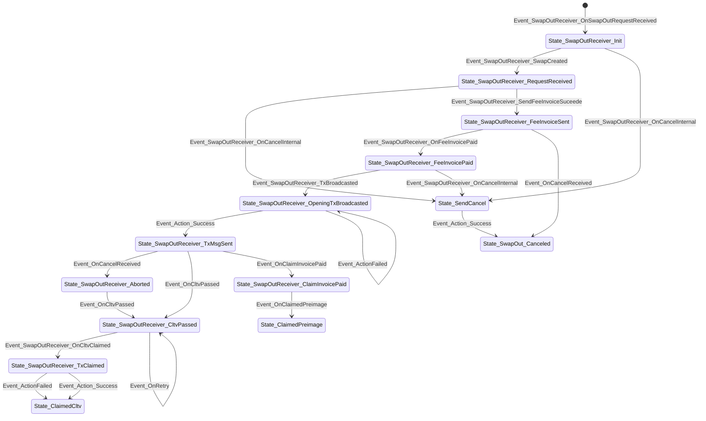

```mermaid
stateDiagram-v2
State_SwapOutReceiver_TxMsgSent
State_SwapOutReceiver_TxMsgSent --> State_SwapOutReceiver_Aborted: Event_OnCancelReceived
State_SwapOutReceiver_TxMsgSent --> State_SwapOutReceiver_CltvPassed: Event_OnCltvPassed
State_SwapOutReceiver_TxMsgSent --> State_SwapOutReceiver_ClaimInvoicePaid: Event_OnClaimInvoicePaid
State_SwapOutReceiver_TxClaimed
State_SwapOutReceiver_TxClaimed --> State_ClaimedCltv: Event_ActionFailed
State_SwapOutReceiver_TxClaimed --> State_ClaimedCltv: Event_Action_Success
State_SendCancel
State_SendCancel --> State_SwapOut_Canceled: Event_Action_Success
State_SwapOutReceiver_Init
State_SwapOutReceiver_Init --> State_SwapOutReceiver_RequestReceived: Event_SwapOutReceiver_SwapCreated
State_SwapOutReceiver_Init --> State_SendCancel: Event_SwapOutReceiver_OnCancelInternal
State_SwapOut_Canceled
State_SwapOutReceiver_RequestReceived
State_SwapOutReceiver_RequestReceived --> State_SendCancel: Event_SwapOutReceiver_OnCancelInternal
State_SwapOutReceiver_RequestReceived --> State_SwapOutReceiver_FeeInvoiceSent: Event_SwapOutReceiver_SendFeeInvoiceSuceede
State_SwapOutReceiver_Aborted
State_SwapOutReceiver_Aborted --> State_SwapOutReceiver_CltvPassed: Event_OnCltvPassed
State_SwapOutReceiver_CltvPassed
State_SwapOutReceiver_CltvPassed --> State_SwapOutReceiver_TxClaimed: Event_SwapOutReceiver_OnCltvClaimed
State_SwapOutReceiver_CltvPassed --> State_SwapOutReceiver_CltvPassed: Event_OnRetry
State_SwapOutReceiver_ClaimInvoicePaid
State_SwapOutReceiver_ClaimInvoicePaid --> State_ClaimedPreimage: Event_OnClaimedPreimage
State_SwapOutReceiver_FeeInvoiceSent
State_SwapOutReceiver_FeeInvoiceSent --> State_SwapOutReceiver_FeeInvoicePaid: Event_SwapOutReceiver_OnFeeInvoicePaid
State_SwapOutReceiver_FeeInvoiceSent --> State_SwapOut_Canceled: Event_OnCancelReceived
State_SwapOutReceiver_FeeInvoicePaid
State_SwapOutReceiver_FeeInvoicePaid --> State_SwapOutReceiver_OpeningTxBroadcasted: Event_SwapOutReceiver_TxBroadcasted
State_SwapOutReceiver_FeeInvoicePaid --> State_SendCancel: Event_SwapOutReceiver_OnCancelInternal
State_SwapOutReceiver_OpeningTxBroadcasted
State_SwapOutReceiver_OpeningTxBroadcasted --> State_SwapOutReceiver_TxMsgSent: Event_Action_Success
State_SwapOutReceiver_OpeningTxBroadcasted --> State_SwapOutReceiver_OpeningTxBroadcasted: Event_ActionFailed
State_ClaimedCltv
State_ClaimedPreimage
[*] --> State_SwapOutReceiver_Init: Event_SwapOutReceiver_OnSwapOutRequestReceived
```