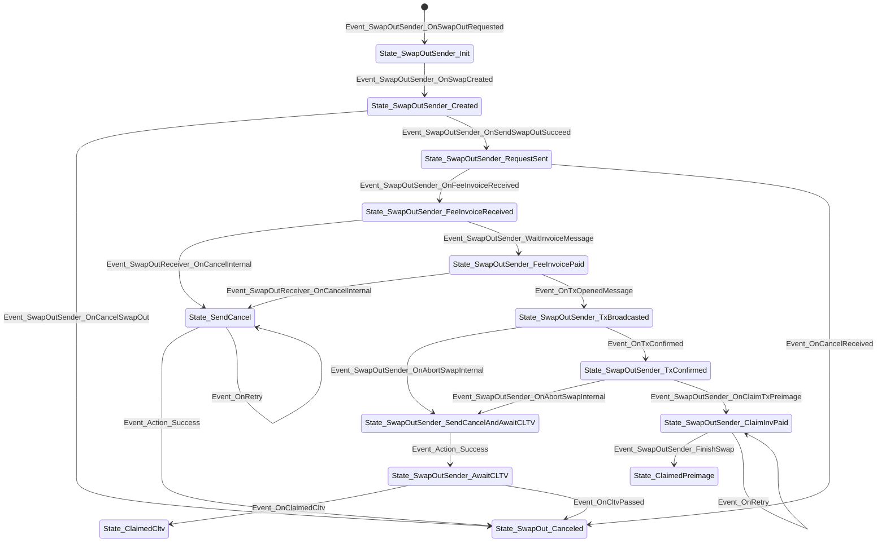

```mermaid
stateDiagram-v2
[*] --> State_SwapOutSender_Init: Event_SwapOutSender_OnSwapOutRequested
State_ClaimedCltv
State_SwapOutSender_Created
State_SwapOutSender_Created --> State_SwapOut_Canceled: Event_SwapOutSender_OnCancelSwapOut
State_SwapOutSender_Created --> State_SwapOutSender_RequestSent: Event_SwapOutSender_OnSendSwapOutSucceed
State_SwapOutSender_FeeInvoiceReceived
State_SwapOutSender_FeeInvoiceReceived --> State_SendCancel: Event_SwapOutReceiver_OnCancelInternal
State_SwapOutSender_FeeInvoiceReceived --> State_SwapOutSender_FeeInvoicePaid: Event_SwapOutSender_WaitInvoiceMessage
State_SwapOutSender_TxConfirmed
State_SwapOutSender_TxConfirmed --> State_SwapOutSender_SendCancelAndAwaitCLTV: Event_SwapOutSender_OnAbortSwapInternal
State_SwapOutSender_TxConfirmed --> State_SwapOutSender_ClaimInvPaid: Event_SwapOutSender_OnClaimTxPreimage
State_SwapOut_Canceled
State_SwapOutSender_AwaitCLTV
State_SwapOutSender_AwaitCLTV --> State_ClaimedCltv: Event_OnClaimedCltv
State_SwapOutSender_AwaitCLTV --> State_SwapOut_Canceled: Event_OnCltvPassed
State_ClaimedPreimage
State_SwapOutSender_Init
State_SwapOutSender_Init --> State_SwapOutSender_Created: Event_SwapOutSender_OnSwapCreated
State_SwapOutSender_RequestSent
State_SwapOutSender_RequestSent --> State_SwapOutSender_FeeInvoiceReceived: Event_SwapOutSender_OnFeeInvoiceReceived
State_SwapOutSender_RequestSent --> State_SwapOut_Canceled: Event_OnCancelReceived
State_SwapOutSender_FeeInvoicePaid
State_SwapOutSender_FeeInvoicePaid --> State_SendCancel: Event_SwapOutReceiver_OnCancelInternal
State_SwapOutSender_FeeInvoicePaid --> State_SwapOutSender_TxBroadcasted: Event_OnTxOpenedMessage
State_SendCancel
State_SendCancel --> State_SwapOut_Canceled: Event_Action_Success
State_SendCancel --> State_SendCancel: Event_OnRetry
State_SwapOutSender_TxBroadcasted
State_SwapOutSender_TxBroadcasted --> State_SwapOutSender_SendCancelAndAwaitCLTV: Event_SwapOutSender_OnAbortSwapInternal
State_SwapOutSender_TxBroadcasted --> State_SwapOutSender_TxConfirmed: Event_OnTxConfirmed
State_SwapOutSender_SendCancelAndAwaitCLTV
State_SwapOutSender_SendCancelAndAwaitCLTV --> State_SwapOutSender_AwaitCLTV: Event_Action_Success
State_SwapOutSender_ClaimInvPaid
State_SwapOutSender_ClaimInvPaid --> State_ClaimedPreimage: Event_SwapOutSender_FinishSwap
State_SwapOutSender_ClaimInvPaid --> State_SwapOutSender_ClaimInvPaid: Event_OnRetry
```