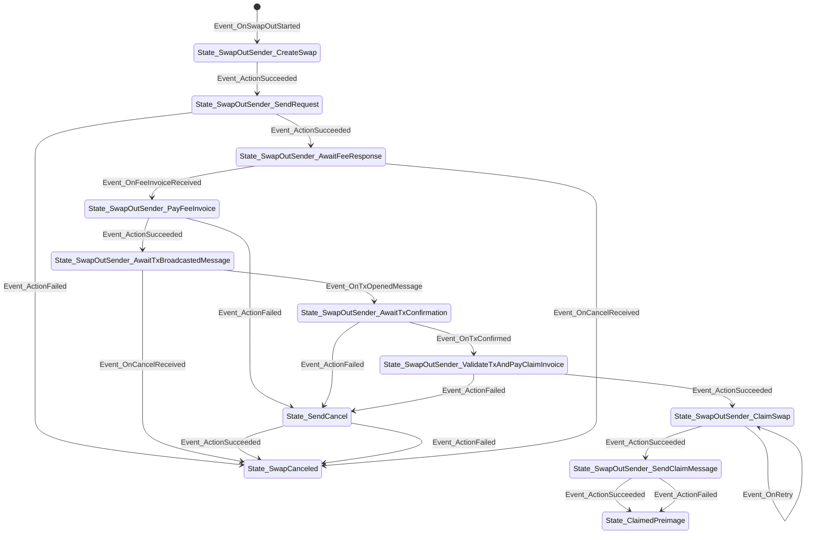

```mermaid
stateDiagram-v2
State_SwapOutSender_CreateSwap
State_SwapOutSender_CreateSwap --> State_SwapOutSender_SendRequest: Event_ActionSucceeded
State_SwapOutSender_SendRequest
State_SwapOutSender_SendRequest --> State_SwapCanceled: Event_ActionFailed
State_SwapOutSender_SendRequest --> State_SwapOutSender_AwaitFeeResponse: Event_ActionSucceeded
State_SwapOutSender_AwaitTxBroadcastedMessage
State_SwapOutSender_AwaitTxBroadcastedMessage --> State_SwapCanceled: Event_OnCancelReceived
State_SwapOutSender_AwaitTxBroadcastedMessage --> State_SwapOutSender_AwaitTxConfirmation: Event_OnTxOpenedMessage
State_SwapOutSender_ClaimSwap
State_SwapOutSender_ClaimSwap --> State_SwapOutSender_SendClaimMessage: Event_ActionSucceeded
State_SwapOutSender_ClaimSwap --> State_SwapOutSender_ClaimSwap: Event_OnRetry
[*] --> State_SwapOutSender_CreateSwap: Event_OnSwapOutStarted
State_SwapOutSender_PayFeeInvoice
State_SwapOutSender_PayFeeInvoice --> State_SendCancel: Event_ActionFailed
State_SwapOutSender_PayFeeInvoice --> State_SwapOutSender_AwaitTxBroadcastedMessage: Event_ActionSucceeded
State_SendCancel
State_SendCancel --> State_SwapCanceled: Event_ActionSucceeded
State_SendCancel --> State_SwapCanceled: Event_ActionFailed
State_SwapOutSender_AwaitTxConfirmation
State_SwapOutSender_AwaitTxConfirmation --> State_SendCancel: Event_ActionFailed
State_SwapOutSender_AwaitTxConfirmation --> State_SwapOutSender_ValidateTxAndPayClaimInvoice: Event_OnTxConfirmed
State_SwapOutSender_ValidateTxAndPayClaimInvoice
State_SwapOutSender_ValidateTxAndPayClaimInvoice --> State_SendCancel: Event_ActionFailed
State_SwapOutSender_ValidateTxAndPayClaimInvoice --> State_SwapOutSender_ClaimSwap: Event_ActionSucceeded
State_SwapOutSender_SendClaimMessage
State_SwapOutSender_SendClaimMessage --> State_ClaimedPreimage: Event_ActionSucceeded
State_SwapOutSender_SendClaimMessage --> State_ClaimedPreimage: Event_ActionFailed
State_SwapCanceled
State_ClaimedPreimage
State_SwapOutSender_AwaitFeeResponse
State_SwapOutSender_AwaitFeeResponse --> State_SwapOutSender_PayFeeInvoice: Event_OnFeeInvoiceReceived
State_SwapOutSender_AwaitFeeResponse --> State_SwapCanceled: Event_OnCancelReceived
```