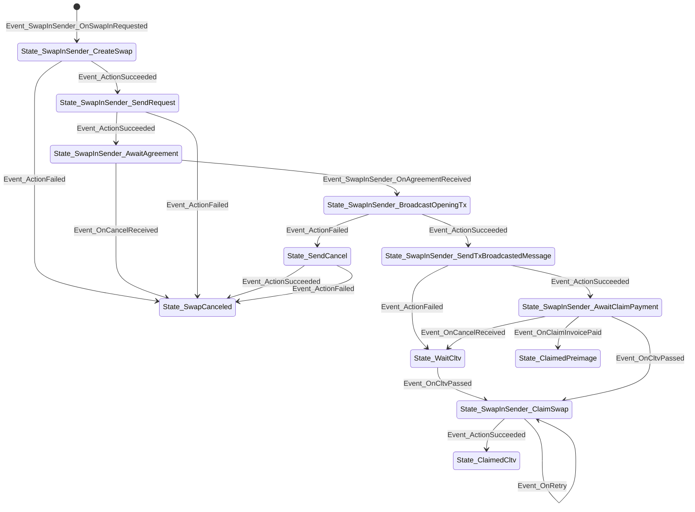

```mermaid
stateDiagram-v2
State_SwapInSender_ClaimSwap
State_SwapInSender_ClaimSwap --> State_ClaimedCltv: Event_ActionSucceeded
State_SwapInSender_ClaimSwap --> State_SwapInSender_ClaimSwap: Event_OnRetry
State_WaitCltv
State_WaitCltv --> State_SwapInSender_ClaimSwap: Event_OnCltvPassed
State_SwapInSender_CreateSwap
State_SwapInSender_CreateSwap --> State_SwapCanceled: Event_ActionFailed
State_SwapInSender_CreateSwap --> State_SwapInSender_SendRequest: Event_ActionSucceeded
State_SwapInSender_AwaitAgreement
State_SwapInSender_AwaitAgreement --> State_SwapInSender_BroadcastOpeningTx: Event_SwapInSender_OnAgreementReceived
State_SwapInSender_AwaitAgreement --> State_SwapCanceled: Event_OnCancelReceived
State_SwapInSender_BroadcastOpeningTx
State_SwapInSender_BroadcastOpeningTx --> State_SendCancel: Event_ActionFailed
State_SwapInSender_BroadcastOpeningTx --> State_SwapInSender_SendTxBroadcastedMessage: Event_ActionSucceeded
State_SwapInSender_SendTxBroadcastedMessage
State_SwapInSender_SendTxBroadcastedMessage --> State_SwapInSender_AwaitClaimPayment: Event_ActionSucceeded
State_SwapInSender_SendTxBroadcastedMessage --> State_WaitCltv: Event_ActionFailed
State_SwapInSender_AwaitClaimPayment
State_SwapInSender_AwaitClaimPayment --> State_ClaimedPreimage: Event_OnClaimInvoicePaid
State_SwapInSender_AwaitClaimPayment --> State_SwapInSender_ClaimSwap: Event_OnCltvPassed
State_SwapInSender_AwaitClaimPayment --> State_WaitCltv: Event_OnCancelReceived
State_ClaimedCltv
[*] --> State_SwapInSender_CreateSwap: Event_SwapInSender_OnSwapInRequested
State_SwapInSender_SendRequest
State_SwapInSender_SendRequest --> State_SwapCanceled: Event_ActionFailed
State_SwapInSender_SendRequest --> State_SwapInSender_AwaitAgreement: Event_ActionSucceeded
State_SendCancel
State_SendCancel --> State_SwapCanceled: Event_ActionSucceeded
State_SendCancel --> State_SwapCanceled: Event_ActionFailed
State_SwapCanceled
State_ClaimedPreimage
```