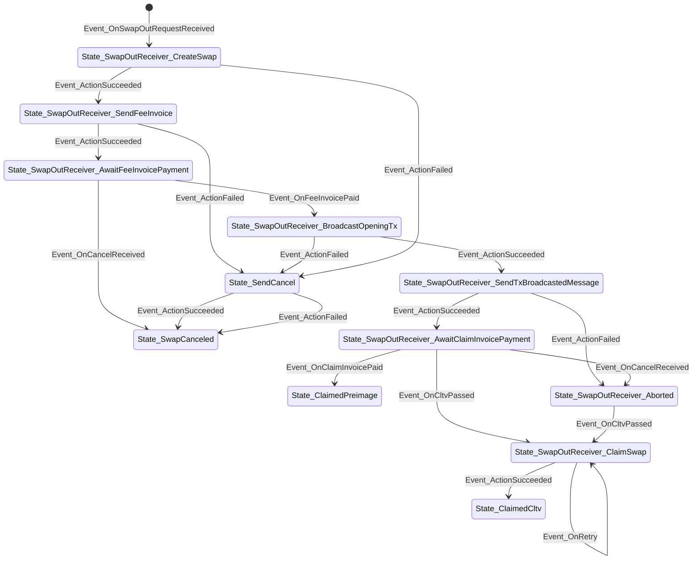

```mermaid
stateDiagram-v2
State_ClaimedPreimage
[*] --> State_SwapOutReceiver_CreateSwap: Event_OnSwapOutRequestReceived
State_SwapOutReceiver_SendFeeInvoice
State_SwapOutReceiver_SendFeeInvoice --> State_SendCancel: Event_ActionFailed
State_SwapOutReceiver_SendFeeInvoice --> State_SwapOutReceiver_AwaitFeeInvoicePayment: Event_ActionSucceeded
State_SwapOutReceiver_BroadcastOpeningTx
State_SwapOutReceiver_BroadcastOpeningTx --> State_SwapOutReceiver_SendTxBroadcastedMessage: Event_ActionSucceeded
State_SwapOutReceiver_BroadcastOpeningTx --> State_SendCancel: Event_ActionFailed
State_SwapOutReceiver_ClaimSwap
State_SwapOutReceiver_ClaimSwap --> State_ClaimedCltv: Event_ActionSucceeded
State_SwapOutReceiver_ClaimSwap --> State_SwapOutReceiver_ClaimSwap: Event_OnRetry
State_SwapCanceled
State_ClaimedCltv
State_SwapOutReceiver_CreateSwap
State_SwapOutReceiver_CreateSwap --> State_SwapOutReceiver_SendFeeInvoice: Event_ActionSucceeded
State_SwapOutReceiver_CreateSwap --> State_SendCancel: Event_ActionFailed
State_SwapOutReceiver_AwaitFeeInvoicePayment
State_SwapOutReceiver_AwaitFeeInvoicePayment --> State_SwapOutReceiver_BroadcastOpeningTx: Event_OnFeeInvoicePaid
State_SwapOutReceiver_AwaitFeeInvoicePayment --> State_SwapCanceled: Event_OnCancelReceived
State_SwapOutReceiver_SendTxBroadcastedMessage
State_SwapOutReceiver_SendTxBroadcastedMessage --> State_SwapOutReceiver_AwaitClaimInvoicePayment: Event_ActionSucceeded
State_SwapOutReceiver_SendTxBroadcastedMessage --> State_SwapOutReceiver_Aborted: Event_ActionFailed
State_SwapOutReceiver_AwaitClaimInvoicePayment
State_SwapOutReceiver_AwaitClaimInvoicePayment --> State_ClaimedPreimage: Event_OnClaimInvoicePaid
State_SwapOutReceiver_AwaitClaimInvoicePayment --> State_SwapOutReceiver_Aborted: Event_OnCancelReceived
State_SwapOutReceiver_AwaitClaimInvoicePayment --> State_SwapOutReceiver_ClaimSwap: Event_OnCltvPassed
State_SwapOutReceiver_Aborted
State_SwapOutReceiver_Aborted --> State_SwapOutReceiver_ClaimSwap: Event_OnCltvPassed
State_SendCancel
State_SendCancel --> State_SwapCanceled: Event_ActionSucceeded
State_SendCancel --> State_SwapCanceled: Event_ActionFailed
```