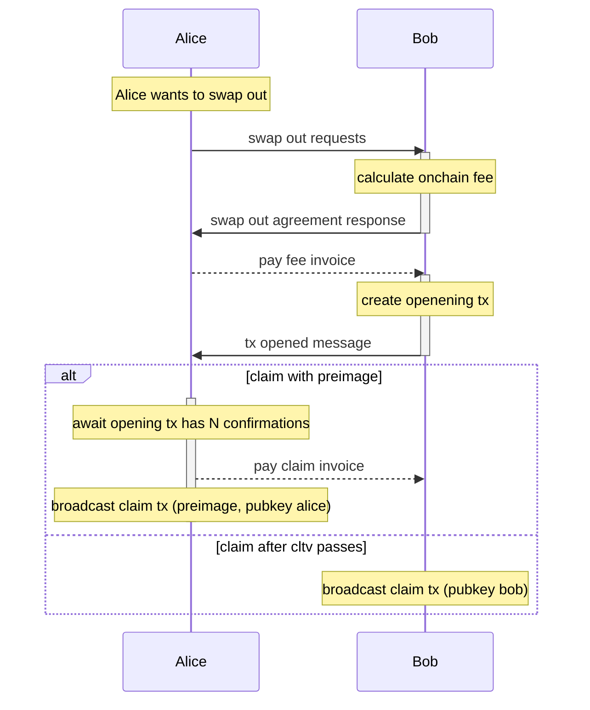

```mermaid
sequenceDiagram
participant A as Alice
participant B as Bob

Note over A: Alice wants to swap out

A->>B: swap out requests
activate B
Note over B: calculate onchain fee
B->>A: swap out agreement response
deactivate B
A-->>B: pay fee invoice
activate B
Note over B: create openening tx
B->>A: tx opened message
deactivate B
alt claim with preimage
activate A
Note over A: await opening tx has N confirmations
A-->>B: pay claim invoice
Note over A: broadcast claim tx (preimage, pubkey alice)
deactivate A
else claim after cltv passes
Note over B: broadcast claim tx (pubkey bob)
end
```